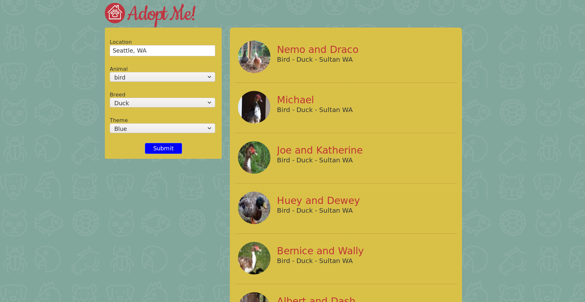
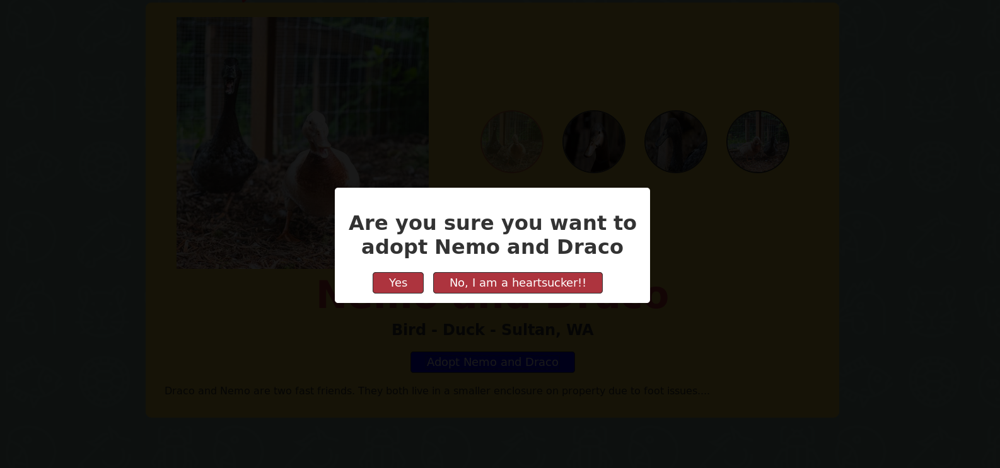

# Pet Adopter
An application to adopt pets near Seattle.

[](https://github.com/nightwarriorftw/adopt-me/issues) [](https://github.com/nightwarriorftw/adopt-me/network/members) [](hhttps://github.com/nightwarriorftw/adopt-me/stargazers)   [](https://twitter.com/intent/follow?screen_name=nightwarriorftw) [](https://telegram.me/nightwarriorftw)


## :nut_and_bolt: Development


#### 1. Clone the Repository

```Bash
git clone https://github.com/nightwarriorftw/adopt-me.git
cd adopt-me
```

#### 2. Install the dependencies

```BASH
npm install
```

#### 3. Run server:

```BASH
npm run dev
```

# :camera: Gallery

Pictures of project.






## :zap: Demo


## :file_folder: File structure
`
├── assets
├── LICENSE
├── package.json
├── package-lock.json
├── README.md
└── src
    ├── App.js
    ├── Carousel.js
    ├── Details.js
    ├── ErrorBoundaries.js
    ├── index.html
    ├── Modal.js
    ├── Navbar.js
    ├── Pet.js
    ├── Results.js
    ├── SearchParams.js
    ├── style.css
    ├── ThemeContext.js
    └── useDropdown.js
`

## :star2: Credit/Acknowledgment

Credit goes to BrianHolt for explaining me concepts of react.

## :lock: License

[LICENSE](/LICENSE)

Since the project uses some API which are been blocked on hosting(as they are paid for production) this project cannot be hosted.

